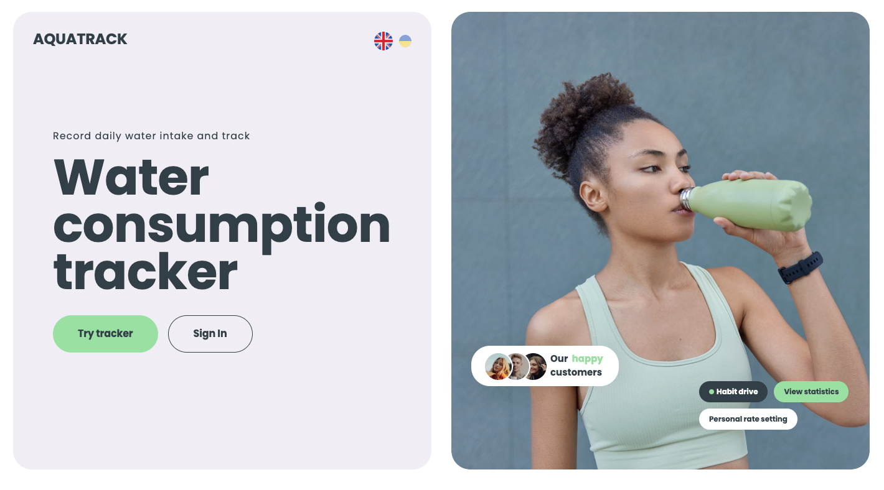
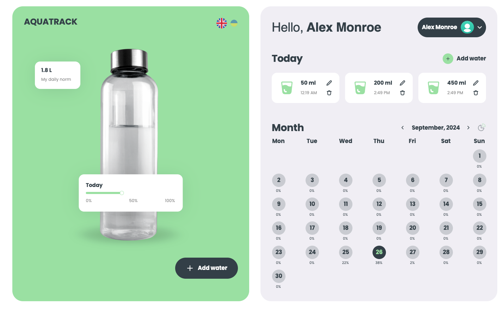

# Aquatracker (FE)

## Description

Tha application allows user to track their water consumption per day and observe
statistics.

## Demo

Login: 

Inside: 

## Base technologies used

- Main app is written with CSS, HTML5, JavaScript.
- State management is done with Redux.js.
- Communication with BE is done with axios.
- Language change id done with i18n-js.
